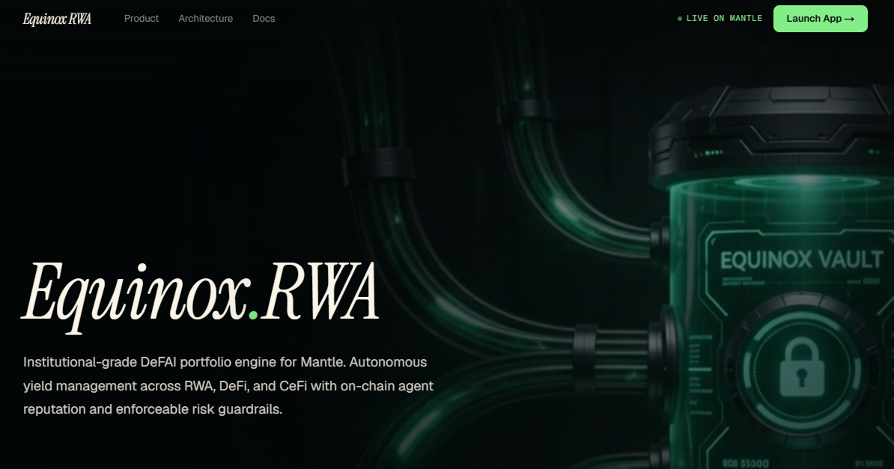

# 🌌 Equinox RWA (The Institutional-Grade DeFAI Portfolio Engine for Mantle Ecosystem)



[](https://nextjs.org/)
[](https://expressjs.com/)
[](https://soliditylang.org/)
[](https://www.mantle.xyz/)
[](https://openrouter.ai/)

Equinox RWA is an institutional-grade yield management infrastructure powered by AI on the Mantle Network. It is equipped with verifiable on-chain reputation (based on the ERC-8004 standard) to automate portfolio rebalancing dynamically across liquid staking (mETH), US-bond-based RWA (USDY), Bitcoin exposure (fBTC), and index assets (MI4). It bridges Web3 liquidity with CeFi (Bybit Earn) through automated backend triggers under rigid, user-configured risk guardrails.

This root folder coordinates the monorepo via `pnpm workspaces` containing the frontend (`fe`) and backend (`be`), while keeping the smart contracts (`sc`) as a Foundry project.

---

## 🎯 Monorepo & System Architecture

The Equinox system separates its off-chain AI reasoning, backend optimization, and on-chain risk enforcement into three core layers:

### 1. 📊 Frontend App (`fe/`)
*   **Purpose**: Web3 user portal and asset command center.
*   **Key Features**:
    *   Live portfolio dashboard displaying Net Asset Value (NAV), current asset allocations (mETH, USDY, fBTC, MI4) in donut charts, and capital topology connections.
    *   Integrated deposit/withdrawal modals that execute transactions directly on Mantle Sepolia.
    *   Agent view displaying active AI agent's ERC-8004 NFT metadata, win-rate, total logged decisions, and current reputation score.
    *   Floating tweaks panel for risk profile adjustment (Conservative, Balanced, Aggressive), visual theme overrides, and agent tone.

### 2. ⚙️ Backend Orchestrator (`be/`)
*   **Purpose**: The operational broker and reasoning coordinator.
*   **Key Features**:
    *   Uses Viem to listen to Mantle blockchain events and signs transactions using an operator wallet.
    *   Fetches off-chain CeFi yields via Bybit API and compares them with Mantle L2 DeFi rates.
    *   Hooks into OpenRouter to generate natural language explanations and confidence scores for rebalancing actions.
    *   Provides secure JSON REST endpoints to serve the frontend portal.

### 3. 📜 Smart Contracts (`sc/`)
*   **Purpose**: The trustless on-chain custody and risk guardrail enforcer.
*   **Key Features**:
    *   **MantleVaultOrchestrator**: Core vault custodying assets, enforcing risk profile allocation boundaries, and performing safe swaps.
    *   **MantleAgentRegistry8004**: Standard ERC-8004 identity registry that mints agent ID NFTs and registers decision reasoning hashes on-chain.
    *   **VaultFactory**: Deploys dedicated vaults and registers agent identities per user (`1 user = 1 vault`, `1 vault = 1 agent ID`).
    *   **StrategyRegistry & Adapters**: Maintains approved strategy venues (MockIdle, MockDeFiLending, MockCeFiEarn) to prevent arbitrary capital routing.

---

## ⚙️ Environment Variables Setup

Before running the application, you must configure the environment variables in each package:

1. **Frontend (`fe/`)**: Copy `fe/.env.example` to `fe/.env`
2. **Backend (`be/`)**: Copy `be/.env.example` to `be/.env`
3. **Smart Contracts (`sc/`)**: Copy `sc/.env.example` to `sc/.env`

Please refer to the respective package READMEs for individual variable configurations and details.

---

## ⚡ Development & Scripts

Ensure you have `pnpm` and `Foundry` installed. Follow these steps to build and run the monorepo:

### 1. Root Monorepo Commands
To manage dependencies and run both application layers (FE & BE) concurrently:

```bash
# Install dependencies for frontend and backend from the root
pnpm install

# Start both frontend and backend development servers concurrently
pnpm dev

# Build both frontend and backend packages
pnpm build

# Lint both frontend and backend packages
pnpm lint
```

### 2. Running Individual Packages
You can execute commands on specific workspaces from the root folder:

```bash
# Run only frontend
pnpm dev:fe

# Run only backend
pnpm dev:be
```

### 3. Smart Contracts (Foundry)
Smart contracts are isolated from `pnpm workspaces`. Run tests and build compiled artifacts directly from the `sc/` folder:

```bash
cd sc
forge build
forge test
```

---

## 🛠️ Technology Stack & Web Standards

*   **Monorepo Workspace**: `pnpm` workspaces.
*   **Frontend Web3 Client**: Next.js 16 (App Router), React 19, Tailwind CSS 4, RainbowKit 2.x, Wagmi 2.x, Viem 2.x, and `@mantleio/sdk`.
*   **Backend Orchestrator**: Node.js, Express.js, Viem 2.x, and OpenRouter API (Gemini models).
*   **Smart Contracts Framework**: Foundry (Solidity 0.8.23) using OpenZeppelin v5 libraries.
*   **Target Network**: Mantle Network (Sepolia Testnet).

---

## 📄 License
Licensed under the **MIT License**.
